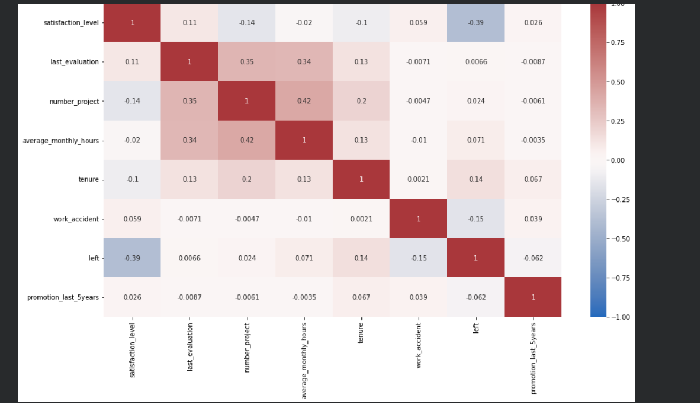
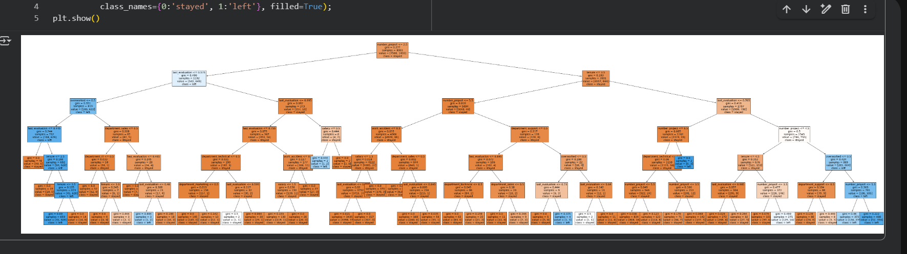
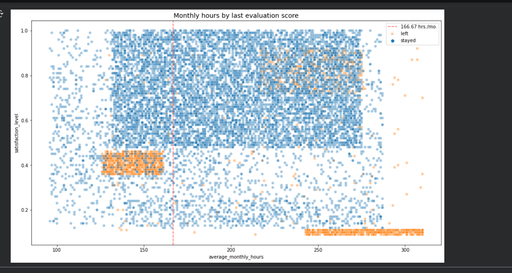
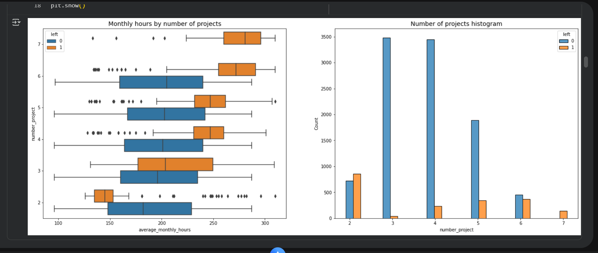
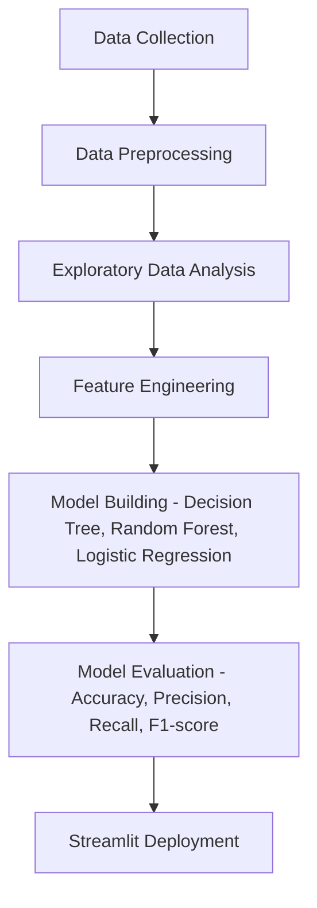

# 🧠 Google Advanced Data Analytics Capstone – End-to-End ML Project  
### 🚀 Employee Attrition Prediction | Machine Learning | Streamlit Deployment  


---

## 🌐 Live Demo  
🎯 **Streamlit App:** [Click here to view the deployed project](https://app-advanced-data-analytics-capstone-end-to-end-ml-project-xcy.streamlit.app/)

---

## 🏆 About the Project  
This project is the final **Capstone** for the **Google Advanced Data Analytics Certificate (Coursera)**, where I applied end-to-end machine learning techniques to solve a real-world business problem:  
> **Predicting employee attrition (whether an employee will stay or leave the company).**

Through this project, I performed **data preprocessing, exploratory data analysis, feature engineering, model building, evaluation, and deployment** using **Streamlit**.

---

## 🧩 Project Objective  
To help HR departments identify the key factors contributing to employee turnover and predict whether an employee is likely to leave or stay, enabling proactive retention strategies.

---

## ⚙️ Tech Stack  

| Category | Tools / Libraries |
|-----------|------------------|
| Programming | Python |
| Data Handling | Pandas, NumPy |
| Visualization | Matplotlib, Seaborn |
| Machine Learning | Scikit-learn (Decision Tree, Random Forest, Logistic Regression) |
| Model Deployment | Streamlit |
| Notebook Environment | Jupyter Notebook |
| Version Control | GitHub |
| Certification Platform | Coursera (Google Advanced Data Analytics) |

---

## 📊 Exploratory Data Analysis (EDA)  

During EDA, I explored key employee attributes such as **satisfaction level, number of projects, average monthly hours, last evaluation, and salary**.  

### 🔹 Heatmap (Feature Correlation)


### 🔹 Decision Tree Visualization


### 🔹 Satisfaction vs Monthly Hours


### 🔹 Number of Projects vs Attrition


---

## 🧮 Machine Learning Workflow  



---

## 🔍 Model Insights  

- Employees with **low satisfaction levels** and **high average monthly hours** tend to leave.  
- **Salary** and **number of projects** strongly influence attrition.  
- Decision Tree visualizations provided clear interpretability for HR decisions.

---

## 📈 Model Performance  

| Model | Accuracy | Precision | Recall | F1-score |
|--------|-----------|-----------|--------|-----------|
| Decision Tree | 97% | 96% | 97% | 96% |
| Random Forest | 98% | 97% | 98% | 97% |
| Logistic Regression | 83% | 82% | 83% | 82% |

---

## 🎥 App Demo  
Watch the working application in action below 👇  

📽️ [Demo Video – Streamlit App](capstone_project%20Recording.mp4)

---

## 🏅 Certification  

### 📜 Google Advanced Data Analytics Capstone Certificate  


🔗 **Verify Credential:** [Coursera Verification Link](https://coursera.org/verify/Z9F0WG7HRN9W)

---

## 🧠 Key Learnings  

- Built end-to-end ML model pipeline (EDA → Training → Evaluation → Deployment).  
- Improved data storytelling through insightful visualizations.  
- Strengthened real-world ML problem-solving skills aligned with Google standards.  

---

## 🔗 Repository Structure  

```
Google-Advanced-Data-Analytics-Capstone-End-to-End-ML-Project/
│
├── Google_Capstone_Project_Model.ipynb   # Main Jupyter Notebook
├── capstone_project Recording.mp4         # App demo video
├── capstone_project pics.png              # EDA visuals
├── capstone_project pics 2.png
├── capstone_project pics 3.png
├── capstone_project pics 4.png
├── Coursera_google cert Z9F0WG7HRN9W.pdf # Certificate
├── Google Data Analytics Certificate Graduate-banner.png
└── README.md                              # Project documentation
```

---

## 🧰 Installation & Usage  

1. Clone this repository:
   ```bash
   git clone https://github.com/karthik-vana/Google-Advanced-Data-Analytics-Capstone-End-to-End-ML-Project.git
   ```
2. Install dependencies:
   ```bash
   pip install -r requirements.txt
   ```
3. Run the Streamlit app:
   ```bash
   streamlit run app.py
   ```

---

## 🧩 Future Enhancements  

- Implement deep learning models for comparison.  
- Add feature importance visualization dashboard.  
- Include real-time HR analytics dashboard using Power BI or Tableau integration.  

---

## 🤝 Connect With Me  

👨‍💻 **Author:** Karthik Vana  
📧 **Email:** [your.email@example.com]  
🌐 **LinkedIn:** [linkedin.com/in/karthik-vana](#)  
📊 **Portfolio:** [Streamlit Project Link](https://app-advanced-data-analytics-capstone-end-to-end-ml-project-xcy.streamlit.app/)

---

### ⭐ If you found this project helpful, don’t forget to **star 🌟** the repository!
